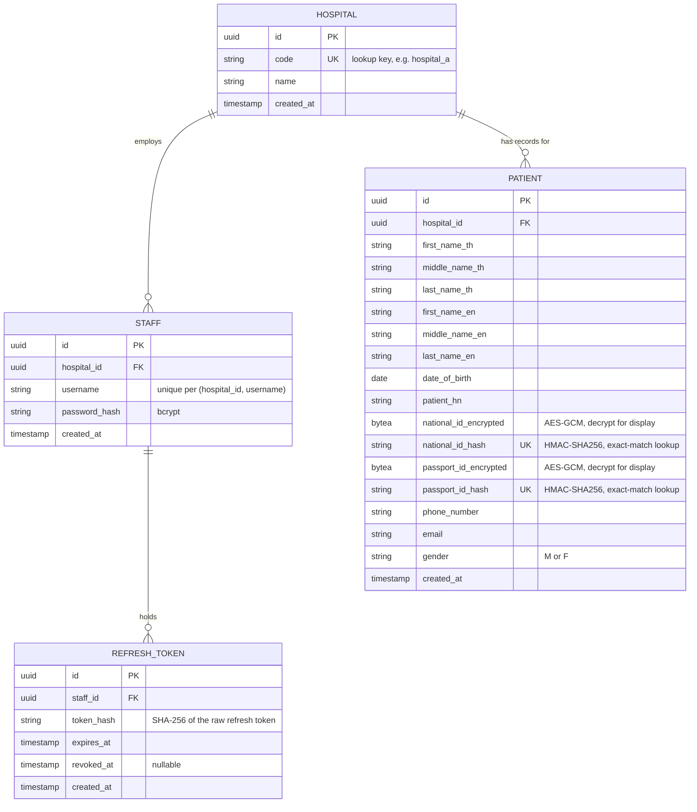

# ER Diagram

## Notes

- **Bilingual name columns**: `Patient` mirrors the Hospital A HIS response shape (`first_name_th`/`first_name_en`, etc.) rather than a single flattened name, per task 2's "compatible with hospital data structures" requirement. `/patient/search`'s flat `first_name`/`middle_name`/`last_name` input matches against both the `_th` and `_en` columns.
- **Blind-index encryption**: `national_id` and `passport_id` are stored encrypted (AES-GCM, random nonce) for display, with a separate deterministic HMAC-SHA256 hash column used for exact-match search (`WHERE national_id_hash = ?`). This avoids storing PII in plaintext while keeping equality lookup possible, without leaking equality patterns the way naive deterministic encryption would. See `internal/crypto`.
- **Tenant isolation**: every `Staff` and `Patient` row carries `hospital_id`. All patient search queries and staff-creation authorization checks filter/compare against the caller's `hospital_id`, derived from JWT claims — never from client-supplied input.
- **RefreshToken**: stores only a hash of the refresh token (never the raw value), scoped to a `staff_id`. `/staff/refresh` rotates (deletes old, inserts new); `/staff/logout` deletes the current one. No reuse-detection cascade (deliberately kept simple).
